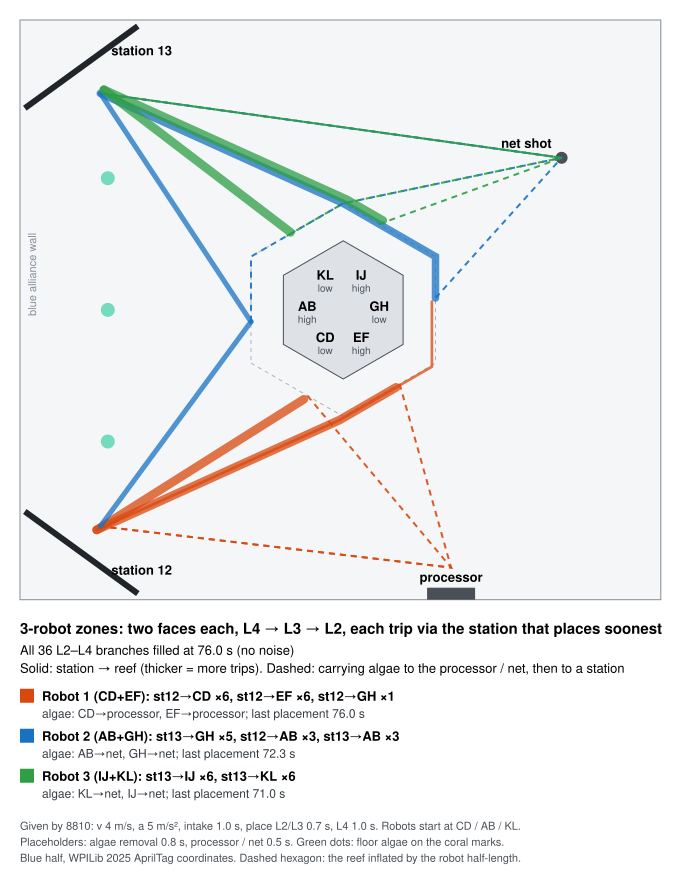

# AlphaStrategy — FRC match strategy simulator (REEFSCAPE 2025 prototype)

[中文](README.md) | English

_Last updated: 2026-09-15_ · By FRC 8810 Alphabots, part of the Alpha* line ([AlphaSim](https://github.com/Alphabots-8810/AlphaSim), [AlphaScout](https://github.com/Alphabots-8810/AlphaScout), [AlphaHarness](https://github.com/Alphabots-8810/AlphaHarness)).

An event-driven FRC match simulator plus three solvers (unfamiliar terms are defined in the [Glossary](#glossary)):
- **Exact single-robot DP**: the theoretical optimum of expected TELEOP points under the simulator's own stochastic model — the ground truth;
- **CRN rollout planner**: handles what the DP can't — three-robot alliance coupling, RP thresholds, win probability. It is the practical choice: 1.4% from the DP optimum at 32 scenarios, about 1 CPU·s per match;
- **Closed-loop MCTS**: also works on a single robot and is also validated against the DP, but needs pruning. For equal accuracy it costs about 6× the compute of rollout; at about 12× it gets about 0.4 points closer to the optimum than rollout. At alliance level, MCTS with the RP objective is currently well behind the heuristics, cause not yet found (see "Known, not fixed").

There is also an **alliance routing model** (`routing.py`): using real field coordinates and acceleration limits, it works out how three robots split the reef, in what order and along which paths, to fill L2–L4. Its parameters are 8810's ideal values; see finding 5.

> ⚠️ v0 prototype. Robot profiles (cycle times, success rates, drive times) are **uncalibrated, hand-set values**, so absolute scores mean nothing — **read the differences and sensitivities**. Calibrate with scouting data before using it for decisions.

## Main findings (assuming the model holds; profiles are placeholders)

**1. Among the policies tested, the highest E[RP] all come from win-first play; rp-seeker, which deliberately fills every level to the threshold, is the lowest.**

Regular-season qualifications, alliance elite + mid + l1bot, opponent with the same profiles and 50% willing to cooperate on Coopertition, 400 matches on fresh seeds. P(win) counts a tie as half a win, so it is not a pure win rate; for E[RP], ± and other notation see the [Glossary](#glossary). The last column is the paired difference vs greedy-net:

| Policy | P(win) | P(coral RP) | E[RP] | ΔE[RP] vs greedy-net |
|---|---|---|---|---|
| CRN rollout, points objective | 0.71 | 0.51 | 4.38 | +1.365 ± 0.152 |
| **CRN rollout, RP objective, z=1 gate** | **0.70** | 0.50 | **4.32** | +1.302 ± 0.143 |
| greedy-proc (all algae to the processor) | 0.63 | 0.50 | 4.12 | +1.110 ± 0.140 |
| rp-seeker (deliberately fills every level to the threshold) | 0.37 | **1.00** | 3.84 | +0.823 ± 0.119 |

rp-seeker gets the Coral RP every match, but the matches it no longer wins cost it more RP overall. A win is worth 3 RP, far more than one bonus RP. rp-seeker also differs from its parent greedy-coop in one more way: a larger endgame reserve (climb_buffer 1.5 vs 1.3), so it leaves to climb or park earlier. How much of its lost wins comes from chasing thresholds and how much from leaving early wasn't separated.

The bold row is the planner that targets RP directly. It is 0.06 RP below the first row, but the paired difference between those two rows wasn't computed, so neither can be called higher.

**How far this conclusion goes**:
- **The RP-objective rollout plays a lot like greedy-proc, but that is not independent evidence.** It sends 8.3 algae to the processor, places only 0.7 coral on L2, and P(coral RP) = P(coop) = 0.50. But it is itself a one-step lookahead on top of greedy-proc: ties keep greedy-proc's action, and the z=1 gate suppresses small deviations. So its resemblance to greedy-proc is partly structural.
- **The ungated version did drift toward the Coral RP**: P(coral RP) 0.70, 3.4 coral on L2 — and E[RP] fell to 3.91. This shows that drifting toward the Coral RP one step at a time doesn't pay; it does not show that no Coral-RP plan pays. A deeper search that can plan several consecutive placements was not tested.
- **It assumes 50% of opponents cooperate.** [Sensitivity section D](results/sensitivity.md) shows that for points-only policies the Coral RP is almost unreachable without coop, so the less cooperative the opponents, the more a deliberate Coral-RP push is worth relative to winning. Where the two cross has not been measured.

**Why most rows of the [Championship table](results/alliance_champs_B.md) match the regular-season table**: same seeds, and these heuristics don't depend on the event type, so they play identically. The two new Championship thresholds barely bind:
- **Coral RP**: when coop is reached, L1, L3 and L4 are almost always all ≥ 7 — replaying greedy-proc, in 198 of 200 coop matches. So whether the threshold is 5 or 7, P(coral RP) ≈ P(coop). In the other 2 matches one level stopped at 6, which is exactly why greedy-proc's P(coral RP) drops from 0.50 to 0.49.
- **Barge RP**: the barge total can only take a few values. elite deep 12 (park 2 on failure), mid shallow 6 (park 2 on failure), l1bot can only park 2. The sum can only be 20, 16, 10 or 6. Replaying greedy-proc's 400 matches: 20 points in 272, 16 in 94, 10 in 32, 6 in 2 — none land at 14–15. So raising the threshold from 14 to 16 changes nothing; P(barge RP) is 0.91–0.92 for every row in both tables.

Only rp-seeker changes visibly: E[RP] 3.84 → 3.54, P(win) 0.37 → 0.27. Every other row's E[RP] moves by at most 0.04.

**2. Processor or net depends on the opponent HP's accuracy.**

The numbers below are paired differences, greedy-proc (all algae to the processor) minus greedy-net (all to the net). Opponent HP accuracy was measured only at 0, 25, 50, 75 and 100%; see [sensitivity section C](results/sensitivity.md).
- By margin: processing pays when the opponent HP's net accuracy is below about 68%. +6.25 points at 50%, −2.49 at 75%; 68% comes from drawing a straight line between these two points (linear interpolation) and was not measured.
- By RP: because coop lowers the Coral RP threshold, processing is still +0.31 RP at 75% and −0.29 RP at 100%. It turns negative somewhere in between — about 88% by linear interpolation, also not measured.

**3. Design priorities.** Exact single-robot DP, elite's expected TELEOP points:

| Change | ΔV* |
|---|---|
| Drive time 10% shorter (action times unchanged) | +5.6 |
| L4 success 0.94→0.99 | +2.7 |
| Intake 0.2 s faster | +2.2 |
| L4 placement 0.3 s faster | +2.1 |
| Deep climb 1.5 s faster | +1.2 |
| Deep climb success 0.90→0.97 | +0.65 |
| Shallow cage instead of deep | −3.9 |
| No algae handling at all | −21.5 |

**4. Which weakness in the alliance is worth fixing.** rp-seeker policy, 3000 paired (CRN) matches; full numbers in [sensitivity section B](results/sensitivity.md):
- l1bot adds L2: +0.52 RP/match;
- mid goes from shallow to deep climb: +0.52;
- elite drive time 10% shorter: +0.41;
- l1bot adds a shallow climb: +0.17;
- mid adds L4: ≈ 0.

**5. Filling L2–L4 as an alliance: the route is worth a few seconds; what matters is each robot's cycle time.**

This finding uses a different model (`routing.py`, not the simulator above): real field coordinates (WPILib 2025 AprilTags), shortest paths around the reef, and each leg timed with acceleration limits (a trapezoidal velocity profile). The parameters are 8810's ideal values: top speed 4 m/s, acceleration 5 m/s², intake 1.0 s, placing L2/L3 0.7 s and L4 1.0 s; algae removal 0.8 s, processor / net 0.5 s and the 0.45 m from robot centre to bumper are placeholders. The reef starts empty (no AUTO); robots blocking each other on the way and defense are not modelled. Full numbers in [results/route_alliance.md](results/route_alliance.md).

- **How many robots can fill it**: 1 robot needs 202 s, so it can't within TELEOP's 135 s; 2 robots 102 s; 3 robots 71 s, at which point each robot's average cycle is about 5.7 s.
- **How you schedule barely matters**:
  - The best fixed plan found by simulated annealing takes 67.7 s, and picking the fastest option at every step takes 71.4 s; with random variation both are about 73 s, and the simple "two faces per robot" is 72.5 s.
  - All 15 ways of giving each robot two faces land between 72.5 and 73.5 s with random variation.
  - No planning at all (each robot keeps one station and fills in AB→KL order) takes 77.3 s — only about 5 s slower.
- **What matters is the cycle time**: 0.5 s more alignment at every stop makes 3 robots 12 s slower. To be full by about 115 s (leaving 20 s for the endgame), each of 3 robots needs an average cycle of at most about 9.3 s, and each of 2 robots at most about 6.3 s (both interpolated linearly between neighbouring rows of section 8 in the results file). Time your own average cycle (defined in the glossary) from match video and look it up in section 8 of the results file.
- **Recommended play**:
  - Zones: CD+EF, AB+GH, IJ+KL; every trip uses the station that gets the coral placed soonest, almost always the one nearest the target face.
  - Place L4 → L3 → L2: the reef fills just as fast (71.1 vs 71.3 s with algae knocked to the floor, 76.0 s both ways when it is carried), but points come in earlier — 8 / 6 more by 20 / 30 s.
  - Carry the algae instead of knocking it to the floor: the 2 from CD and EF go to the processor (for coop in qualifications), the other 4 to the net. This costs about 5 s (77.7 vs 72.5 s with random variation) and earns 28 points; the opponent HP can get back at most 8.
  - With random variation this play fills the reef in a median 77.2 s, p90 81.3 s.



## Quick start

```bash
python3.11 -m venv .venv && .venv/bin/pip install -e '.[dev]'
.venv/bin/python -m pytest -q                       # 170 tests, ~25 s
.venv/bin/python experiments/validate.py            # single robot: DP vs heuristics vs planners (fresh seeds)
.venv/bin/python experiments/tune_mcts.py --rollouts proc --c 0.5 --prune 0,25 --matches 120 --out results/tune_mcts_prune.md   # MCTS pruning comparison
.venv/bin/python experiments/tune_mcts.py --rollouts proc --c 0.02,0.05,0.1,0.2,0.5 --prune 0 --matches 120 --out results/tune_mcts_sweep.md   # unpruned MCTS, c sweep
.venv/bin/python experiments/alliance.py --seed-offset 200000   # alliance: heuristics vs rollout / MCTS
.venv/bin/python experiments/sensitivity.py --dp    # sensitivities (the deliverable)
.venv/bin/python experiments/tie_rule_ab.py         # effect of the rollout tie rule (lesson 5)
.venv/bin/python experiments/route_alliance.py      # alliance fill of L2–L4: routes, zones, order, algae (a few minutes)
results/run_final.sh                                # rerun every experiment the README cites (no tests; ~1 hour, all cores)
```

## Model

**Rules** (`src/frcsim/reefscape2025/rules.py`) checked line by line against the 2025 Game Manual (Section 5 rev. 4, Section 6 rev. 13, Section 7 rev. 11) and Team Update 21:

| Item | Value |
|---|---|
| Timing | AUTO 15 s, TELEOP 135 s |
| Coral points (AUTO / TELEOP) | L1 3/2, L2 4/3, L3 6/4, L4 7/5 |
| Algae | Processor 6, Net 4 |
| Barge | Park 2, Shallow 6, Deep 12 |
| Branches | 12 per level on L2–L4; L1 (trough) unlimited |
| Possession limit | 1 coral + 1 algae (G409) |
| Coral RP | ≥ 5 per level in regular season / DCMP; ≥ 7 at Championship (TU21); 3 levels once Coopertition is reached |
| Barge RP | 14 points in regular season; 16 at Championship |
| Coopertition | Qualifications only; each alliance processes ≥ 2 |

Algae we process rolls into the opponent's Processor Area, where their HP can throw it into **their own** net for 4 points. The model keeps this coupling.

**Decision structure**: an asynchronous semi-MDP. When a robot finishes its current macro action it becomes the actor and picks the next one from `INTAKE / L1–L4 / REM_LOW / REM_HIGH / NET / PROC / FLOOR / CLIMB / PARK`. Time runs on a dt = 0.25 s grid. Each action's duration = travel + service, modelled as one lognormal and discretised into k equal-probability atoms. The simulator and the DP read **the same duration table**.

**Alliance coupling** (the reasons "add up each robot's points per second" is wrong):
- 2 coral stations, each a queue serving one robot at a time;
- the processor serves one robot at a time;
- reef congestion: the more robots at the reef, the longer the service time;
- branch capacity and staged-algae state are shared by all three robots;
- the floor algae pool is shared.

**Opponent**: v0 has no defense. The opponent is a pre-sampled exogenous outcome (total points, algae processed). It couples to us through only two channels: processor → HP net throws, and Coopertition. 50% of opponents cooperate, so deciding whether to process means inferring whether coop will actually happen this match.

**AUTO** outcomes are sampled from the profile, not optimised. AUTO is a pre-written routine, not a decision problem.

## Solvers

| Module | What it does |
|---|---|
| `dp.py` | Single robot, expected TELEOP points. State = (location, holding coral, holding algae, #L2, #L3, #L4, low/high algae left), 562,432 states; backward induction over 540 time steps, about 50 s vectorised. L1 count, processor count and coop don't affect optimal decisions under this objective, so they are dropped from the state. RP thresholds and win objectives blow up the state; those go to the planners (CRN rollout / MCTS). |
| `mcts.py` | Closed-loop UCT with chance nodes: children are told apart by the exact situation after the action. Expands the heuristic's action first; optional progressive bias and `action_filter` pruning. Only the robot that just became free decides at any moment, so each step compares one robot's actions (at most 12), not every combination of three robots' actions (up to 12³ = 1,728). |
| `policies.py` | `Greedy`: points-per-second greedy with an endgame time reserve; algae modes net/proc/coop.<br>`rp_seeker`: an RP-chasing variant.<br>**`RolloutPolicy`**: CRN one-step lookahead (Bertsekas rollout) — each candidate action is followed by the base heuristic under the same batch of random scenarios, and the best mean wins.<br>`MCTSPolicy`: re-plans at every decision point in the match; `NoEarlyTerminal` does the pruning. |

Five objectives:
- `teleop`: same as the DP;
- `points`: our score;
- `margin`: ours minus theirs, including the points our processing hands to the opponent HP — the continuous quantity win probability actually depends on monotonically;
- `win`: win probability;
- `rp`: expected RP, 0 in playoffs.

`win` and `rp` are discrete and need the z gate when planning (see lesson 3).

**No planner can peek**: scenario seeds come from the planner's own RNG. When the match has an opponent, opponents are sampled only from the planner's own bank; with an opponent but no bank, planning raises immediately (`_no_peek`). Single-robot experiments have no opponent and need no bank.

**Randomness and CRN**: in the world simulation every uniform random number is a hash of (seed, robot, action, n-th use), so different policies on the same seed get the same luck on the same kind of task (common random numbers), and differences can be compared with paired CIs.

Planning clones can't see the world's future either, but the two planners do it differently:
- **CRN rollout**: scenario clones use the same hash, with the seed replaced by a scenario seed drawn from the planner's own RNG. So within a scenario the candidate actions draw paired numbers — which is also where the exact ties of lesson 5 come from.
- **MCTS**: clones draw directly from the planner's own `random.Random`.

Neither can read the world's seed.

## Validation

Configuration for V2–V4: single elite robot, TELEOP, dt 0.25 s, k 5, algae blocking B, regular season. V1 uses small instances; full size can't be brute-forced.

| Check | Result |
|---|---|
| V1: DP = brute-force expectimax (enumerated with the simulator's own transition function, `tests/test_dp.py`) | All agree within 1e-9:<br>• dt 0.5 s, k 3, 7 s horizon: 11 start states over 4 profiles × blocking readings A/B, 22 cases;<br>• dt 1.0 s, k 2, 16 s horizon with ring-buffer wraparound, 4 cases;<br>• a 9 s endgame window, 1 case. |
| V2: DP-optimal policy replayed in the simulator (4000 matches); V* should fall inside the replay's ± range | 108.65 ± 0.19, V* = 108.635 ✅ |
| V3: no heuristic beats V* (numbers are paired differences vs the DP-optimal policy) | greedy-proc −3.37, greedy-coop −11.5, greedy-net −18.0, rp-seeker −22.2 ✅ |

**V4: how far the planners are from optimal.** Run on fresh seeds (100000–100199), disjoint from the tuning seeds. The base heuristic is greedy-proc, paired gap to the DP −3.54.

| Planner | Paired gap vs DP | vs base | CPU·s/match |
|---|---|---|---|
| CRN rollout, 8 scenarios | −3.00 ± 0.47 (−2.8%) | +0.54 | 0.2 |
| CRN rollout, 16 scenarios | −1.88 ± 0.40 (−1.7%) | +1.67 | 0.5 |
| **CRN rollout, 32 scenarios** | **−1.50 ± 0.39 (−1.4%)** | **+2.04** | **1.1** |
| MCTS 200 iterations (pruned) | −3.63 ± 0.52 (−3.3%) | −0.09 | 0.8 |
| MCTS 800 iterations (pruned) | −1.91 ± 0.42 (−1.8%) | +1.64 | 3.0 |
| MCTS 3200 iterations (pruned) | −1.07 ± 0.34 (−1.0%) | +2.47 | 12.9 |

How to read it:
- **Compute at equal accuracy**: rollout with 16 scenarios (−1.88, 0.5 CPU·s) vs MCTS with 800 iterations (−1.91, 3.0 CPU·s) — MCTS costs about 6×;
- **MCTS can get closer**: 3200 iterations reach −1.07, about 0.4 points closer than rollout with 32 scenarios (−1.50), at about 12× the compute;
- the rollout rows are sensitive to which action is taken on ties — a different tie rule shifts them by about 0.5 points; see lesson 5.

**Five lessons about the planners** (all backed by experiments):

1. **Plain UCT loses to the heuristic it simulates with (its rollout policy, see [Glossary](#glossary)) on this problem** — with greedy-proc as the rollout policy it scores 4.5–11 points below simply playing greedy-proc — and more iterations are not necessarily better. UCT expands every action once at every node, including one-step match-killers like going to PARK/CLIMB at second 10. Those samples are mean-backed-up into every ancestor edge, biased toward different actions, and scramble the action ranking. Adding "ignore endgame actions while more than 25 s remain" removes the loss, and more iterations then help. See `results/tune_mcts_sweep.md` (unpruned, c sweep) and `results/tune_mcts_prune.md` (pruning comparison).
2. **Per-match luck is far larger than the gap between good actions (1–3 points).** Back-computed from the 95% CIs of the [validate](results/validate_elite.md) and [alliance](results/alliance_regular_B.md) tables, the per-match standard deviation is about 6 points for single-robot TELEOP and about 10 for alliance totals. CRN rollout compares every candidate on the same random scenarios, cancelling most of that variance, so it reaches the same accuracy with about 1/6 of MCTS's compute. This generalises to FRC-type problems: for the same compute, paired Monte Carlo comparison beats tree search.
3. **Discrete objectives hit the optimizer's curse.** In the alliance experiments, rollout-win's P(win):

   | Scenarios | 16 | 32 | 64 | 16 with z=1 gate |
   |---|---|---|---|---|
   | P(win) | 0.54 | 0.55 | 0.61 | **0.71** |

   For comparison, its base greedy-proc is 0.63.

   Why: flipping one scenario from loss to win outweighs a 20-point score difference, so the planner leaves the base action because of one scenario's luck. The gate rule: leave the base action only if the paired improvement exceeds 1 standard error. At 16 scenarios it removes the problem with no extra compute. z=1 was fixed in advance, not swept.
4. **Discrete objectives like win and rp need a tie-break.** At most decision points the match is already won or lost in every sampled scenario, so every candidate ties. Without a tie-break the planner takes the first action in legal-list order — L1 before L4, INTAKE before CLIMB. The fix has two parts: keep the base heuristic's action on ties, and add 1e-4 per expected point as a secondary key (`policies.Objective`).

   **Ablation**: current code with only those two parts reverted, nothing else changed. 400 matches from seed 500000, 16 scenarios, results in `results/tie_rule_ab.md`.

   | rollout-win | P(win) | E[RP] |
   |---|---|---|
   | Fixed | 0.52 | 3.88 |
   | Reverted | 0.22 | 2.37 |

   For comparison, its base greedy-proc has P(win) 0.63. Even fixed, rollout-win stays below its base — that is lesson 3's optimizer's curse, which the z gate addresses.
5. **Continuous objectives also tie exactly, often, and the tie rule is worth about 0.5 points** (`experiments/tie_rule_ab.py`, results in `results/tie_rule_ab.md`).

   **Why exact ties happen**: world random numbers are keyed by (seed, robot, action, n-th use). Two candidates that are the same set of actions in a different order — INTAKE then REM_LOW, or the reverse — draw the same luck. By the buzzer they have completed the same set of actions, so they score exactly the same in every scenario.

   **Measured** (rollout, 32 scenarios, 30 matches):
   - of 1214 decisions, 241 (19.9%) tie exactly at the maximum, 232 of them with more than 25 s left;
   - on 115 of them the two rules pick different actions — 47.7% of tied decisions, 9.5% of all decisions. The pre-fix rule takes the first in legal order, mostly INTAKE; the current rule keeps the base action, mostly REM_LOW, REM_HIGH or PROC.

   **A/B** (fresh seeds, paired; positive means the pre-fix rule is better):

   | Setting | Objective | Pre-fix − current |
   |---|---|---|
   | Single robot, seeds 400000–400199, 16 scenarios | TELEOP points | +0.34 ± 0.46 |
   | Single robot, seeds 400000–400199, 32 scenarios | TELEOP points | +0.56 ± 0.37 |
   | Alliance, 400 matches from seed 500000, 16 scenarios | points objective | points +0.56 ± 0.37, P(win) +0.021 ± 0.023, E[RP] +0.005 ± 0.081 |
   | Same | margin objective | margin +0.74 ± 0.44, E[RP] +0.013 ± 0.082 |

   Only the two continuous objectives, points and margin, were measured. Adding these differences to the points and margin rows of the [full alliance table](results/alliance_regular_B.md) changes neither row's rank in E[RP] or P(win). The win / rp rows use the same tie rule and were not rerun.

   **The current rule stays**, for two reasons:
   - the pre-fix rule's advantage comes only from INTAKE happening to be first in the action list — there is no reason behind it;
   - the current rule has a stated property (on ties it can't do worse than base), and every alliance-table number was produced with it.

   Switching rules because the numbers look better and then rerunning would be another round of the winner's curse.

   **Takeaways**:
   - one-step lookahead is structurally blind to the value of action order;
   - the tie frequency comes partly from how CRN draws its numbers, not purely from the game.

   So rollout's 1.3–1.5 point gap to the DP is the same order of magnitude as the effect of an arbitrary tie-break (0.3–0.6 points). Improvements are listed under "Next steps".

What the DP-optimal policy does (500-match average):
- nearly fills L4's 12 branches (11.89 on average), plus about 1 L3 per match;
- removes all 6 algae and processes almost all of them ("knock algae off → carry it to the station for coral → process on the way → back to the reef for L4");
- leaves to climb at 124 s into TELEOP (about 11 s left).

This behaviour rests on two assumptions: `elite.hold_both=True` (it can hold 1 coral + 1 algae at once), and the own-points objective not seeing the points processing hands to the opponent HP.

## Independent audit (two multi-agent rounds, with adversarial re-checks)

Items and numbers marked † come from one-off audit scripts; neither the scripts nor their outputs are in the repo.

**Confirmed correct**:
- Rule constants checked line by line against the manual and TUs — all correct.
- † **DP and the single-robot simulator are equivalent at full size**: forward probability-mass propagation computes the DP policy's exact value in the simulator, over 1,818,682 merged states. It differs from V* by 1.4e-10 — floating-point accumulation.
- † **246 further small cases against brute-force expectimax**: many profile variants plus 24 random profiles, with REEF, STATION and random start states. In settings where no queue can form, the maximum deviation is 3.6e-15.
- Planners can't peek: neither the world seed nor the true opponent is readable while planning.
- † **Fuzzing over 2000 random configurations** (random alliance composition, event type, policies, etc.): all invariants hold.

**Fixed**:
- the 3 algae pre-placed on the coral marks were not modelled;
- playoffs still awarded RP;
- PARK scoring was inconsistent with CLIMB;
- endgame actions polluted MCTS's mean backups;
- discrete objectives took the list-order action on ties;
- reef congestion also counted partners who had already left the reef, inflating the congestion effect about 2.6× †;
- a lone robot could hit a "phantom queue" (waiting in a queue with no one ahead);
- after congestion seconds were rounded, the "REEF congestion ×2" row of the [sensitivity analysis](results/sensitivity.md) was really 2.2× †;
- RolloutPolicy couldn't be pickled (so it couldn't run in parallel worker processes);
- tuning and reporting used the same seeds.

**Known, not fixed**:
- HP net throws ignore the time left: algae processed in the last few seconds still count as throwable by the opponent HP. Measured to have no effect †: over 400 matches for each of three heuristics and 100 for rollout-rp (z=1), zero processor scores completed in the last 5 s; the closest was 16 s from the end.
- At alliance level, MCTS-rp (300 iterations, pruned) is still well behind greedy-proc, the heuristic it simulates with: P(win) 0.23 vs 0.63, E[RP] 3.27 vs 4.12. The cause isn't located — possibly small-budget noise, mean pollution at internal nodes, or c calibrated on the single robot not transferring to the rp objective. Until it is, use CRN rollout at alliance level.

## Assumptions

1. **Algae blocking: reading B is confirmed** (low algae blocks L2+L3 on its face, high algae blocks L3; 0 L3 available at the start). The manual doesn't state it directly, but the sources agree:
   - Manual §6.5.1: coral touching algae doesn't score; §6.3.4.2: "Staged ALGAE will not contact CORAL placed on L4".
   - Chief Delphi thread 482048, an early-season discussion: [post 88](https://www.chiefdelphi.com/t/482048/88) (jacob6838, with a photo) says a high algae blocks both L3 branches it sits on, and a low algae touches coral on L3 and blocks L2; [post 102](https://www.chiefdelphi.com/t/482048/102) (Garrison) says 6 L2 branches are not blocked.
   - Which faces carry which algae is known too: AB, EF, IJ high; CD, GH, KL low (6328 RobotCode2025Public `FieldConstants`; see `routing.py`).

   Reading A (each algae blocks only the pair it rests on, leaving 6 on each of L2/L3) is kept for comparison only.
2. **Profile values**: the travel matrix, action durations, success rates and HP net accuracy (default 50%) are all placeholders. The "about 68%" break-even in finding 2 depends directly on them.
3. **elite can hold 1 coral + 1 algae at once** (`hold_both=True`). The DP-optimal "carry algae to the station" trick depends on it.
4. No defense, fouls or mechanism failures, and dropped coral can't be picked up again. The 3 coral-mark algae are assumed still on the floor at the start of TELEOP (AUTO's effect on them isn't modelled), and their pickup point is approximated as near the reef.

## Next steps

1. **Calibrate with [AlphaScout](https://github.com/Alphabots-8810/AlphaScout)**: TBA's score breakdowns are per alliance, so per-team cycle distributions only come from scouting. With each team's empirical distribution in its profile, the simulator can do pre-match planning (how three teams split the work) and pick lists.
2. **2026 REBUILT**: reuse the engine and rewrite only the game module. Model dumper and turret as two robot profiles (shot time, accuracy vs distance, shooting on the move) and compare them with CRN rollout and sensitivity analysis.
3. **Opponents and defense**: turn the opponent from an exogenous sample into policy archetypes, compute the pairwise win-probability matrix, and solve for the mixed equilibrium with an LP.
4. **The planner's tie rule** (lesson 5): let the planner tell apart "the same actions in a different order". Two candidates: a time-integrated "scoring earlier is better" secondary key, or a two-step lookahead on tied candidates. Each must be validated against the DP before it replaces the current rule.

## Glossary

Look terms up as needed; there is no need to read it all. The main findings mostly use the first three groups (finding 5 also uses the last one); the fourth and fifth cover solver and model details.

### Reading the numbers

| Term | Meaning |
|---|---|
| **E[X] (expected value)** | The average of X if you could play unlimited matches. Simulations estimate it, hence the ±; the DP computes it exactly, so V\* and ΔV\* have no ±. E[RP] = average RP per match. |
| **P(X)** | The probability of X — in simulation, the fraction of matches where it happens. P(coral RP) = fraction of matches that earn the Coral RP. **P(win) is the exception: a tie counts as half a win** (the average of win 1, tie 0.5, loss 0). |
| **Δ** | A difference. ΔE[RP] vs greedy-net = this policy's E[RP] minus greedy-net's; ΔV\* = how much V\* changes when one parameter changes. |
| **Standard deviation / variance** | Standard deviation (SD): the typical size of the match-to-match swing around the average. "About 6 points per match" means single matches often land about 6 points above or below the average. Variance = SD squared; "cancelling variance" = removing those luck swings. |
| **Standard error** | How far an average is likely to be from the true long-run average: about SD ÷ √(number of samples). Samples can be matches, or the scenarios a planner uses at one decision (the z gate uses the latter). |
| **± / 95% confidence interval (CI)** | Every ± in this repo is the half-width of a 95% confidence interval, about 2 standard errors (1.96 exactly). "+1.30 ± 0.14" means: playing unlimited matches in this model, the average lands between 1.16 and 1.44 with 95% confidence. It only covers the error from simulating a finite number of matches — **not the error from wrong profile values** — and it says nothing about real matches. |
| **Reading ±** | If the range includes 0 (e.g. +0.34 ± 0.46, i.e. −0.12 to +0.80), the difference can't be told apart from luck. Two rows that are each compared with greedy-net can't be ranked against each other by their ±; you need the paired difference between those two rows. |
| **Seed** | The number that fixes all the luck in one simulated match. The same policy on the same seed gives exactly the same result. "Fresh seeds" = seeds not used during tuning, so we can't have picked a batch that happens to look good. |
| **Paired comparison / paired difference** | Run two options on the same batch of seeds, subtract match by match, then average. The luck both share cancels, so the error is far smaller than comparing them separately. |
| **CRN (common random numbers)** | The technique that gives the options being compared the same luck; paired comparison relies on it. When simulating a match, the random numbers each action uses are computed from (seed, robot, action, n-th time doing it). So on a given seed, elite's 3rd INTAKE succeeds or fails identically under every policy, and its duration falls in about the same fast-or-slow band; the exact seconds still depend on where it starts from and on queueing. AUTO and HP-throw draws have their own keys. |
| **Linear interpolation** | Only two points were measured, so draw a straight line between them and read values in between, e.g. where the line crosses zero. Finding 2's "about 68%" and "about 88%" are estimated this way, not measured. |
| **Sensitivity** | Change one parameter (e.g. L4 success rate) and see how much the optimal score or E[RP] moves. Results in [results/sensitivity.md](results/sensitivity.md). |
| **Ablation** | Revert one change and nothing else, and see how much the result moves — this measures what the change is worth. |
| **A/B comparison** | Two versions compared under the same conditions, e.g. the old and new tie rules. Unrelated to algae-blocking readings A and B. |
| **1e-N** | Scientific notation: 1e-4 = 0.0001, 1e-9 = 0.000000001. Differences of order 1e-9 mean "identical" — they are computer rounding error. |

### This repo's policies and robots

| Term | Meaning |
|---|---|
| **greedy-net / greedy-proc / greedy-coop** | Greedy heuristics: always take the action with the most expected points per second, and reserve time for the endgame climb. They differ only in where algae go: all to the net / all to the processor / to the processor until coop's 2 are done, then to the net. |
| **rp-seeker** | A variant of greedy-coop with two differences. First, an RP bonus: any action that advances the Coral RP or coop earns 6 extra points of credit (e.g. placing coral on a level still below the threshold), so it deliberately fills every level to the threshold. Second, a larger endgame reserve (climb_buffer 1.5 vs greedy's default 1.3), so it leaves to climb or park earlier. |
| **rollout-points / rollout-margin / rollout-win / rollout-rp** | CRN rollout with points / margin / win value / expected RP as the objective; names ending in z1 use the z=1 gate. |
| **Win-first play** | Play that goes for points and winning, picking up bonus RPs along the way without chasing them — the top three rows of finding 1's table. |
| **elite / mid / l1bot** | Three preset robots, all placeholder values. elite scores L1–L4, handles algae, can hold 1 coral + 1 algae at once, deep climb. mid scores L1–L3, can knock low algae off the reef (can't hold it; it drops to the floor), shallow climb, 1.3× elite's drive time. l1bot scores only L1, can only park, 1.5× drive time. |

### Game rules (REEFSCAPE 2025)

| Term | Meaning |
|---|---|
| **Coral / algae** | The two game pieces. Coral goes on the reef's L1–L4; algae go into the processor or the net. |
| **L1–L4 / branch** | The reef's four coral levels. L2–L4 have 12 branches (the posts coral sits on) per level; L1 is a trough with no limit. |
| **Processor / net / HP** | The two places algae go. The processor is worth 6, but the algae roll to the other side, where the opponent's HP (human player at the field edge) can throw them into their own net for another 4; a robot scoring in the net gets 4 directly. |
| **Staged algae / algae blocking A, B** | The 6 algae placed on the reef at the start (high on AB, EF, IJ; low on CD, GH, KL) block some branches. Reading B is confirmed: low algae blocks L2+L3 on its face, high algae blocks L3; reading A is kept for comparison only. See "Assumptions", item 1. |
| **Coopertition (coop)** | Qualifications only: each alliance puts at least 2 algae in its processor. Once reached, the Coral RP needs only 3 levels at the threshold. |
| **RP** | Ranking Points, the qualification ranking score. Win 3, tie 1, plus three bonus RPs: Auto RP, Coral RP, Barge RP. No RP in playoffs. |
| **Coral RP** | Every level L1–L4 reaches the threshold: 5 in regular season and at District Championships (DCMP), 7 at Championship; with coop, 3 levels are enough. |
| **Barge RP** | Endgame barge points reach the threshold: 14 in regular season and at DCMP, 16 at Championship. |
| **Auto RP** | In AUTO, every robot leaves the starting line and at least 1 coral is scored. |
| **Park / shallow / deep climb** | Endgame: park in the barge zone (2 points) / hang on a shallow cage (6) / deep cage (12). |
| **Action names** | INTAKE fetches coral from a station; L1–L4 place coral; REM_LOW / REM_HIGH knock low / high algae off the reef; NET / PROC put algae in the net / processor; FLOOR picks algae up from the floor; CLIMB climbs; PARK parks. |
| **hold_both** | Whether a robot can hold 1 coral and 1 algae at once (the rule's limit is 1 of each, G409). |

### Solvers

| Term | Meaning |
|---|---|
| **Policy / heuristic / planner / solver** | Policy = any rule that picks the next action in every situation. Heuristic = a simple hand-written, fixed rule. Planner = a policy that simulates ahead at each decision during the match (CRN rollout, MCTS). Solver = the three methods in this repo (DP, CRN rollout, MCTS). |
| **Greedy** | Always take what looks best right now (here: the most expected points per second), without thinking ahead. |
| **State / situation** | Everything needed to make a decision, e.g. where the robot is, what it holds, how many coral are on each level, how much time is left. "State blow-up" = every extra thing to track multiplies the number of states, until there are too many to compute. |
| **DP (dynamic programming)** | Work backward from the buzzer (backward induction) to find the best action in every state. This repo's DP state is: where the robot is, what it holds, how many coral are on L2/L3/L4, how many low/high staged algae remain, times 540 time steps. It is exactly optimal only in a simplified setting: one robot, TELEOP only, no floor algae. Optimizing RP or win probability would also need the L1 count, coop, partners and opponents — the state blows up — so those go to the planners. |
| **V\*** | The optimal expected TELEOP score from the single-robot DP — the theoretical ceiling within this model. |
| **Monte Carlo** | Estimating a result by averaging many random simulations. CRN rollout and MCTS are both Monte Carlo methods. |
| **Base heuristic / base action** | The heuristic a planner uses as its default play; greedy-proc by default here. Base action = the action the base heuristic would pick in the current situation. |
| **Rollout (one-step lookahead)** | At each decision point, try every candidate action: take it, then follow the base heuristic to the buzzer; repeat several times, average, and pick the best (the method is named after Bertsekas). Everything after the first step is left to the heuristic, so it picks one step at a time and can't find a plan that only pays off after several non-greedy moves in a row; methods that plan several moves ahead are "deeper search", e.g. MCTS. |
| **Scenario** | One simulated future used in a rollout trial. Its seed is drawn by the planner, not taken from this match. "32 scenarios" = every candidate action is run in the same 32 futures. |
| **CRN rollout** | All candidate actions are compared on the same batch of scenarios, so the luck they share cancels and the comparison is far less noisy. With a finite number of scenarios some noise remains, especially for discrete objectives (lessons 3 and 5). |
| **World / clone** | World = the simulated match actually being played and scored. Clone = a copy of the current match that a planner plays forward privately; its luck comes from the planner's own scenario seeds, never from the world's seed. |
| **MCTS (Monte Carlo tree search)** | Builds a "do this, then that" decision tree while simulating, giving more simulations to branches that look promising. It can look many steps ahead but costs more compute than rollout. |
| **Search-tree vocabulary** | Node = a situation; edge = an action (or a lucky/unlucky outcome) leading from a situation; child = a situation one step later; ancestors = the situations on the path from the start; expand = try an action for the first time. A tree branch has nothing to do with a reef branch. |
| **Iteration / rollout policy** | One MCTS iteration = pick a path down the tree → simulate to the buzzer with a heuristic → pass the result back along the path. The heuristic used for that simulation is called the rollout policy in MCTS (greedy-proc here) — not the CRN rollout planner above. |
| **Mean backup** | Passing an iteration's result back along the path: each edge keeps the average score of every simulation that went through it; nodes only count visits. |
| **UCT / c** | UCT (Upper Confidence bounds applied to Trees) is the formula MCTS uses to pick an edge: try high-average edges more, but give rarely tried ones a chance. The larger c is, the more it tries rarely tried edges. The right c depends on the scale of the scores (points in the hundreds vs RP 0–6), so a c tuned for one objective may not suit another. |
| **Closed-loop / chance node** | Chance node = a point in the tree where luck (did it succeed, how long did it take) decides where to go. Closed-loop = the tree branches on the luck that actually happened, so the next decision is made after seeing the outcome — not the PID sense of closed-loop control. |
| **Pruning / `NoEarlyTerminal` / terminal actions** | CLIMB and PARK are terminal actions: once a robot does either, its match is over. Pruning applies to MCTS only: while more than 25 s remain, MCTS doesn't consider terminal actions (unless they are the only legal ones). CRN rollout doesn't prune. |
| **Progressive bias** | An MCTS option: lean toward the heuristic's recommended action at first, and let the data take over as simulations accumulate. |
| **Expectimax / transition function** | Expectimax = expand every action and every outcome and compute them all; only feasible on tiny problems. Transition function = the simulator's rule for "this action in this situation leads to these next situations with these probabilities". V1 checks the DP against an expectimax built on the simulator's transition function. |
| **Objective** | What a planner maximizes, five kinds: teleop (single-robot TELEOP points, same as the DP), points (our score), margin (our score − theirs), win (win value: win 1, tie 0.5, loss 0), rp (expected RP). |
| **Continuous / discrete objective** | teleop, points and margin change in small steps — continuous objectives; a bigger margin always means a better chance to win. win and rp take only a few values; one scenario flipping from loss to win makes the result jump, so comparisons are very noisy — discrete objectives. |
| **Optimizer's curse / winner's curse** | Pick the largest of many noisy estimates and you tend to pick a lucky one rather than the truly best, so actual performance falls short of the estimate. |
| **z gate (z=1)** | A candidate replaces the base action only if its paired mean improvement over the base action exceeds z standard errors; otherwise the base action stays. The standard error here is computed over the 16 or 32 scenarios at that one decision. This repo uses z = 1, to counter the optimizer's curse (lesson 3). |
| **Tie / tie-break / legal order** | How to choose when several candidates score exactly the same in every scenario. For win / rp, each action first gets a tiny points bonus (0.0001 per point), so when win values tie the higher-scoring action wins; if they still tie exactly, keep the base action. points and margin use only the second rule. Legal order = the fixed order in which the code lists the currently allowed actions (L1 before L4, INTAKE before CLIMB); before the fix, ties took the first action in that list. |
| **Tuning / sweep** | Tuning = trying settings (c, number of scenarios, …) and keeping what works. Sweep = trying a range of values for one parameter. Tuning on the seeds you report would pick lucky settings, so reported numbers always use fresh seeds; z = 1 was fixed in advance, not swept. |
| **Accuracy / gap** | In V4, "equal accuracy" means the same distance from the DP optimum (e.g. both about 1.9 points short), not the width of the ±. |
| **CPU·s/match** | Single-core CPU seconds to run one match. |

### Model

| Term | Meaning |
|---|---|
| **Profile** | A robot's parameter sheet: each action's time and success rate, driving speed, which actions it can do. All hand-set placeholders for now. |
| **Macro action / service time** | Macro action = one complete action, including driving there and doing it — e.g. L4 = drive to the reef and place one L4. Duration = travel time + service time; service time is the time spent doing the action once there (intake, place, climb), called "action times" in finding 3. |
| **Event-driven** | The simulation doesn't tick through small time slices; it jumps straight to the next moment something happens, e.g. a robot finishing an action. |
| **MDP / semi-MDP / actor / asynchronous** | MDP (Markov decision process) = a decision model where you pick an action from the current situation and the outcome involves luck. Semi = steps take varying time. Asynchronous = the three robots don't decide at the same moment; whoever becomes free first picks first. The robot that just became free and must decide is the actor. |
| **dt / time step** | The time grid, 0.25 s; every duration is rounded to a multiple of it. TELEOP's 135 s is 540 time steps. |
| **Lognormal / k atoms** | Action durations follow a lognormal distribution (always positive, with a right tail), represented by k equal-probability quantile points, k = 5 by default. The slowest is the 90th percentile, so the model has no "occasionally very long" delays. Points that round to the same dt step are merged. The simulator and the DP read the same duration table. |
| **Coupling** | The three robots affect each other: they compete for coral stations and the processor, congest the reef, and share branches and floor algae. See "Alliance coupling". |
| **Exogenous opponent / opponent bank / `_no_peek`** | The opponent is not simulated as robots that react to us: its result (total points, algae processed) is drawn at random beforehand and doesn't respond to how we play — that is what "exogenous" means. The bank is a batch of pre-simulated opponent outcomes; planners can only draw from their own bank and can't read this match's real opponent, and `_no_peek` is the check that enforces this. |
| **Policy archetypes / win-probability matrix / mixed equilibrium / LP** | Terms from "Next steps" 3. Archetypes = a few typical playstyles; win-probability matrix = the win chance of every playstyle against every other; mixed equilibrium = the mix of playstyles that is hardest to exploit; LP (linear programming) is the math used to find it. |
| **Empirical distribution** | A distribution measured from scouting data: how long each cycle took and whether it succeeded, not just the average. |
| **V1–V4 / manual revisions** | V1–V4 number the validation checks; see "Validation". "Section 5 rev. 4" etc. in the rules paragraph are manual revisions, unrelated to validation check V4. |
| **Audit / adversarial re-check** | Several AI agents split up the checking of code and claims; every confirmation and every bug report was then re-checked by another agent trying to prove it wrong. |
| **†** | The number comes from a one-off audit script; neither the script nor its output is in the repo. |
| **Invariant / fuzzing** | Invariant = a property that must always hold, e.g. "coral on each of L2–L4 never exceeds the unblocked branches". The repo's tests check invariants by simulating random actions; the audit also ran 2000 random configurations (†) — that is fuzzing. |
| **Forward probability propagation** | Instead of sampling matches, push the exact probability of every situation forward from the start, step by step (identical situations combined), which gives a policy's exact average score. The audit used it to confirm the DP and the simulator agree. |

### Alliance routing (finding 5)

| Term | Meaning |
|---|---|
| **Cycle** | The time between one robot's consecutive placements: after placing, go back to a station, pick up and place the next — queueing and algae removal included. This repo's "average cycle" = a robot's time from the start to its last placement ÷ the coral it placed. |
| **Trapezoidal velocity profile** | Accelerate from rest to top speed, cruise, decelerate to a stop; speed vs time is a trapezoid, or a triangle when the leg is too short to reach top speed. Leg time = distance ÷ top speed + top speed ÷ acceleration (triangle: 2√(distance ÷ acceleration)). |
| **Lower bound** | A time no schedule can beat: all the unavoidable work (each coral's intake, placement, shortest trips, algae removal) split evenly across the robots, with no waiting. The closer a schedule gets to it, the less there is left to optimize. |
| **Simulated annealing** | A search method: change the plan at random (swap two coral, or hand one to another robot), keep changes that are faster, and keep slower ones with a probability that shrinks over time, so the search doesn't get stuck on a merely "locally best" plan. |
| **Fixed plan / reactive** | Fixed plan = decide before the match which coral each robot places, in which order; reactive = after each placement, pick whatever is fastest right now. |
| **Zones** | Each robot is responsible for a fixed set of reef faces and helps the others once its own are full. |
| **p10 / p50 / p90 / p99** | Percentiles: sort all simulated results from fastest to slowest and take the value 10% / 50% / 90% / 99% of the way along. p50 is the median; p90 = 90% of matches are faster. |

## Layout

```
src/frcsim/mcts.py                 game-agnostic MCTS (split out along a file boundary only; no generic game interface)
src/frcsim/reefscape2025/          rules / profiles / simulator / DP / policies / alliance routing (routing.py)
experiments/                       validate, planners, tune_mcts, alliance, sensitivity, tie_rule_ab, route_alliance
tests/                             DP vs expectimax (incl. ring-buffer wraparound), simulator invariants, RP logic, planners, MCTS convergence, alliance routing
results/                           experiment outputs: validate_elite.md, alliance_{regular,champs}_B.md, sensitivity.md, tune_mcts_{prune,sweep}.md, tie_rule_ab.md, route_alliance.{md,svg}
```

## License

MIT — see [LICENSE](LICENSE).
